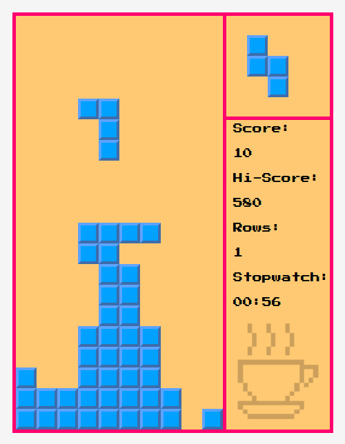

# Tetris
DHTML game. React + Redux.

### Install
0. `$ git clone https://github.com/magicwantabstract/tetris.git`
1. `$ cd tetris`
2. `$ npm i`
3. `$ npm run start`
4. open `http://localhost:9000`

### Control
| Action     | Key            |
|------------|----------------|
| Exit       | Escape         |
| Play       | P              |
| Pause      | M              |
| Move right | Arrow Right, D |
| Move left  | Arrow Left, A  |
| Rotate     | Enter, Space   |
